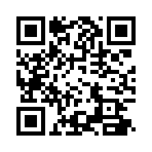
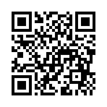

# Text processing use cases

- Extract statistical information from text data
- Search/index large text documents
- Custom parsers to extract limited information

> For instance, extract one-two fields from the json

---

# For example

- Count number of words
- Count number of times word is present in the text
- Extract few fields values from json

---

### Count number of words in the text

Assume that the number of words is close to the number of spaces.
We will be only counting `' '` and `'\n'` characters.

For simplicity we assume that custom utf-8 characters are not used.

For huge texts small error in count is allowable.



---

```asm
...
.LBB0_6:
        vmovd   xmm5, dword ptr [rdi + rax]
        vmovd   xmm6, dword ptr [rdi + rax + 4]
        vmovd   xmm7, dword ptr [rdi + rax + 8]
        vmovd   xmm8, dword ptr [rdi + rax + 12]
        vpcmpeqb        k0, xmm5, xmm1
        vpcmpeqb        k1, xmm6, xmm1
        vpcmpeqb        k2, xmm7, xmm1
        vpcmpeqb        k3, xmm8, xmm1
        vpmovm2q        ymm5, k0
        vpsubq  ymm0, ymm0, ymm5
        vpmovm2q        ymm5, k1
        vpsubq  ymm2, ymm2, ymm5
        vpmovm2q        ymm5, k2
        vpsubq  ymm3, ymm3, ymm5
        vpmovm2q        ymm5, k3
        vpsubq  ymm4, ymm4, ymm5
...
```

---

### Count number of times word is found in the text

We will find matching substring with exact match to input query.



---

### Extract 2 fields from small json (107b) message from Binance exchange 
(no implementation provided)


