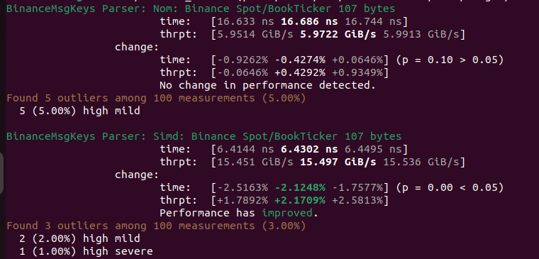

# Text processing use cases

- Extract statistical information from text data
- Search/index large text documents
- Custom parsers to extract limited information

> For instance, extract one-two fields from the json

---

# For example

- Count number of words
- Count number of times word is present in the text
- Extract few fields values from json

---

### Count number of words in the text

Assume that the number of words is close to the number of spaces.
We will be only counting `' '` and `'\n'` characters.

For simplicity we assume that custom utf-8 characters are not used.

For huge texts small error in count is allowable.

---

### Count number of times word is found in the text

We will find matching substring with exact match to input query.

---

### Extract 2 fields from small json (107b) message from Binance exchange 
(no implementation provided)

