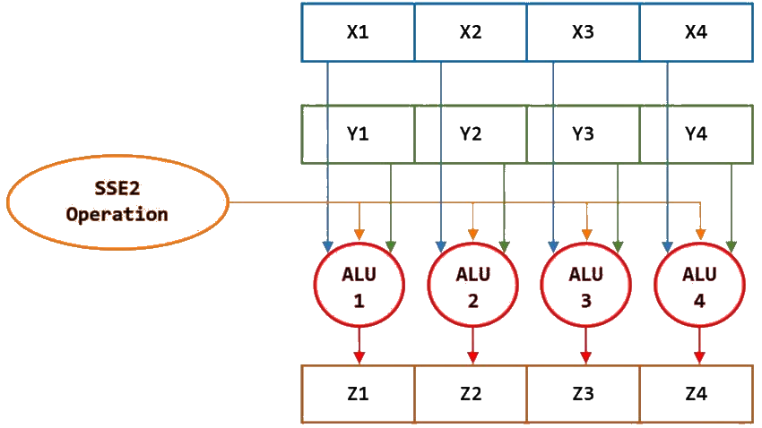
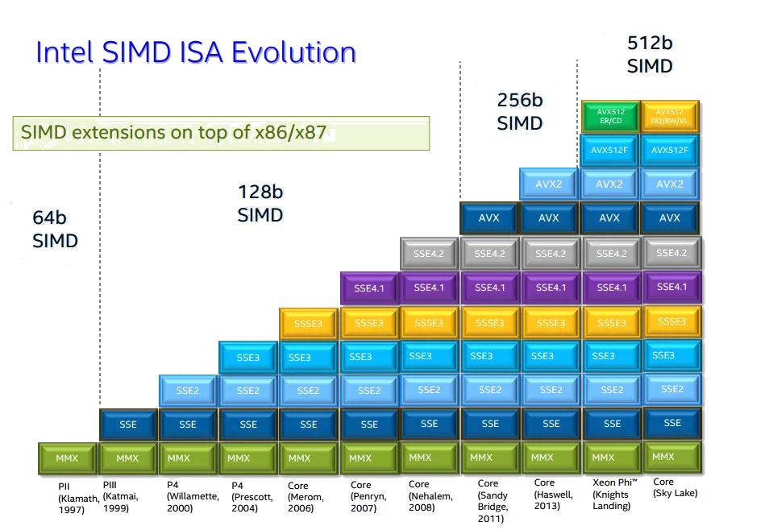

# Single Instruction Multiple Data

---

---

# Registers

|          | Size | Register |
|----------|------------|---------|
| MMX      | 64-bit    | XMM     |
| SSE*     | 128-bit   | XMM     |
| AVX/2    | 256-bit   | YMM     |
| AVX512   | 512-bit   | ZMM     |

> AVX512 is disabled with 12th & 13th Gen

---

# Support in Rust

## stable

- LLVM is doing decent job vectorizing iterators
- `std::arch` provides access to SIMD primitives

>  RUSTFLAGS='-C target-cpu=native'
>  RUSTFLAGS='-C target-feature=+avx2'

## nightly

- `portable_simd` feature provides type Simd<T, N>

---

# When do we need it

- Processing large arrays of data
- But! Usually it is responsibility of compiler

## In rare cases it might be used explicitly

- Language is not expressive enough for engineer to communicate abstractions
- Allows for faster processing and cost saving

> Danger! Beware of dragons and memory issues
